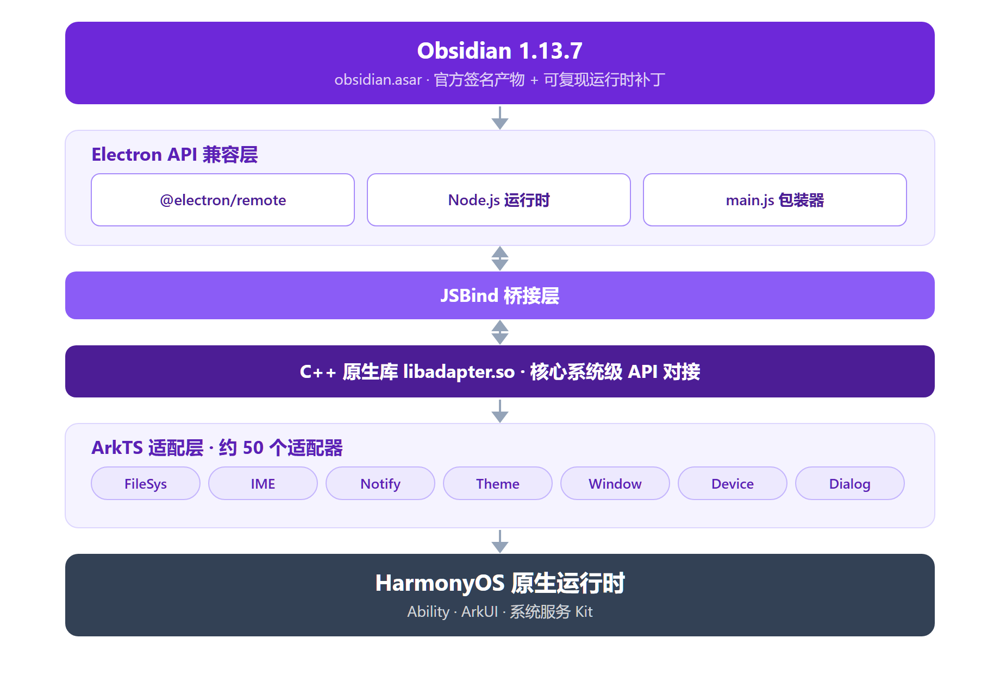

<p align="center">
  
</p>

<h1 align="center">OHsidian</h1>

<p align="center">
  <strong>Obsidian for HarmonyOS</strong>
</p>

<p align="center">
  <strong>简体中文</strong> | <a href="README_EN.md">English</a>
</p>

<p align="center">
  在 HarmonyOS 平板与 2in1 电脑上，提供与桌面版一致的 Obsidian 笔记体验，支持多窗口与系统级原生适配。<br>
  本 Fork 已移除华为云相关功能（云同步、华为账号登录、AGC），详见下文。<br>
  仅支持平板与 2in1 电脑，暂不支持手机。
</p>

<p align="center">
  
  
  
  
</p>

---

## 目录

- [项目简介](#项目简介)
- [本 Fork 相对原版的改进](#本-fork-相对原版的改进)
- [平板功能演示](docs/tablet-demo.md)
- [技术架构](#技术架构)
- [功能特性](#功能特性)
- [模块结构](#模块结构)
- [适配层](#适配层)
- [构建与运行](#构建与运行)
- [项目结构](#项目结构)
- [依赖说明](#依赖说明)
- [许可协议](#许可协议)
- [致谢](#致谢)

---

## 项目简介

**OHsidian** 是 Obsidian 笔记应用在 HarmonyOS（鸿蒙）平台上的非官方移植项目。它不重新实现 Obsidian，而是构建一个完整的 Electron 兼容层，运行真正的 Obsidian（`obsidian.asar`，官方产物加运行时补丁）。

核心思路是：**用 HarmonyOS 原生能力模拟 Electron API 表面**。项目通过 C++ 原生库（`libadapter.so`）、ArkTS 适配层与 JSBind 桥接，让 Obsidian 的 Node.js / Electron 运行时在 HarmonyOS 上正常运转；同时深度集成系统级能力（状态栏扩展、输入法框架等），让体验更接近原生应用。

| 项目信息 | 内容 |
|---------|------|
| 应用 ID | `com.mikannqaq.obsidian` |
| 版本号 | 1.0.0（versionCode 为 1000000） |
| 目标 SDK | HarmonyOS 6.1.1 / API 24 |
| 目标设备 | 平板、2in1 电脑（不支持手机） |
| 开发语言 | ArkTS（TypeScript） |
| 构建系统 | Hvigor |
| 内核版本 | Obsidian 1.13.7 |

---

## 本 Fork 相对原版的改进

本 Fork（[PCFXPCFX/OHSidian][fork]）基于上游仓库（[HanversionOvO/OHSidian][upstream]，OHsidian 原创始人 HanversionOvO，昵称 MikannQAQ）构建，在其 Electron 兼容层之上做了大量窗口、输入、数据与工程化修复。完整变更记录见[变更日志][changes]（逐轮审计，持续追加）。

平板相关功能的图文与动图演示，见[平板功能演示][tablet-demo]。

### 窗口与显示

- 按官方沉浸式规范重做窗口链路：layout fullscreen 加真实系统条 insets，触摸模式下状态栏与导航条正确避让；修复启动铺不满、底部死区的问题。
- 引擎只读取一次 surface 尺寸：增加几何稳定门控与首启强制整屏，修复首次进入时视口超宽、控件超出屏幕的问题。
- 多窗口（自由窗口）：使用系统标题条并做内容避让，消除双关闭按钮与白条；窗口矩形超出屏幕时，自动钳制到屏幕的 80% 并居中。
- 触摸模式与多窗口模式跟随系统 PC 模式开关自动切换。

### 输入与首次启动

- 修复触摸模式下的仓库切换与管理（绕过引擎有缺陷的原生下拉弹窗）。
- 把输入法高度（`--keyboard-height`）提供给引擎，加粗等格式化工具栏正确悬浮在键盘上方。
- 修复快速开始的“folder not found”报错（默认仓库重定向到可写目录）。

### 外部内容接入

- **拖入即插入**：中转站（单张/多张）、文件管理器、截图悬浮窗的图片和文件拖到编辑器上即插入为附件。修复原版单张图片拖入时触发 "Open external link?" 弹窗、确认与否都无法插入的问题（根因：`general.file-uri` 记录被解析短路吞掉、文件路径以纯文本形态漏给引擎被当成链接）。
- **跨应用文件自动取回**：其他应用沙箱里的拖拽文件（如中转站暂存目录，本应用命名空间不可见）由适配层借拖拽授予的临时 URI 权限自动复制进应用缓存，引擎读不到的文件不再降级成链接；文件管理器等本就可读的来源保持原路径直通，不引入额外拷贝。
- **系统分享目标（Share Kit）**：注册 `ohos.want.action.sendData`，分享面板（图库、文件管理器等）可直接把图片、视频、音频、任意文件和文本分享到 Obsidian，经统一清洗管线插入当前聚焦的笔记；应用未运行时分享，启动后自动投递。接收端用 `systemShare.getSharedData` 官方 API 解析，不依赖任何发送方私有键名。
- **碰一碰 / 跨设备**：经系统拖拽（UDMF）到达的跨设备内容天然走拖入管线；以 Want 形式到达的内容走分享目标路径。架构与剩余验证项见 docs/DRAG-DROP-INBOUND.md。

### 数据安全与耗电

- 应用内删除笔记统一进入回收站，绝不直接永久删除。鸿蒙没有对第三方应用开放的系统回收站 API，引擎回收站桥行为不可控，删除动作因此被改写为本地搬移。
- 回收站落点重定向到文件管理可见的 `文档/OHSidianTrash/<仓库名>/`。仓库内的 `.trash` 是以点号开头的隐藏文件夹，文件管理不显示，已删除的文件原本无法触达。
- 每次启动 60 秒后自动清理回收站：超过 30 天的文件删除，空目录一并清掉。
- 命令面板新增“迁移仓库到文件管理可见的位置”：把仓库（含 `.trash`）复制到系统文件夹选择器授权的目录，文件管理器与电脑可以直接访问（沙箱目录本身无法暴露，这是鸿蒙的系统约束）。
- 关闭自动更新，鸿蒙分发走本仓库 Release。引擎内的更新链路（检测 `obsidian-{version}.asar` 更新包、RSA 校验、热加载）保留，但不会触发，避免无意义的联网探测。升级时，下载新版 Release 包覆盖安装即可。
- 移除无效的云同步轮询、共享 GNSS 单订阅、亮屏锁前台守卫与日志截断，降低耗电。

### 深链与工程化

- `obsidian://` 深链桥接：Remotely Save 等插件的浏览器 OAuth 登录可用。
- GitHub Actions 全自动构建：Release 附 SHA-256 / MD5 校验值，支持可选签名、同版双图标发布（OHsidian 图标 / Obsidian 官方图标）、可选变体，以及 SDK 组合与构建模式选择。`obsidian.asar` 不入库，构建时从官方源下载、校验哈希与签名后注入补丁，并断言补丁标记完整。
- 关闭 Release 构建的 ArkGuard 混淆。原版以 Release 模式构建会因混淆在启动时闪退，这是本 Fork 能正常分发的关键修复。

---

## 技术架构



*图：OHsidian 分层架构。图中已省略华为账号与云存储相关组件（本 Fork 移除）。*

**分层说明**（自上而下）：

- **Obsidian 层**：官方 obsidian-1.13.7.asar 签名产物（下载时做 SHA-256 与官方 RSA-SHA256 校验），经 `scripts/update-obsidian.mjs` 补丁管线注入运行时兼容补丁（IPC 守卫、`obsidian://` 深链桥、触摸模式适配、默认仓库重定向、回收站重定向与 30 天清理、CLI 服务套接字重定向、自动更新关闭）；笔记编辑核心未改动。Obsidian 为专有软件，版权归其权利人所有，本仓库与其无任何关联。
- **Electron 兼容层**：`@electron/remote` 提供 remote 模块 API，`main.js` 负责加载 asar 与更新管理。
- **JSBind 桥接层**：连接 JS 运行时与 ArkTS 原生层，把 Electron API 调用转发到对应的适配器。
- **C++ 原生库**：`libadapter.so` 提供核心系统级 API 对接。
- **ArkTS 适配层**：约 50 个适配器，把 HarmonyOS API 包装为 Electron 兼容接口。
- **HarmonyOS 底层**：系统原生能力，包括 Ability 组件、ArkUI 界面等（华为账号与云存储已在本 Fork 移除）。

---

## 功能特性

### Obsidian 核心体验

- 完整的 Obsidian 1.13.7 笔记编辑与管理功能。
- 兼容全部社区插件与主题。
- 本地 Vault（知识库）的创建、管理与浏览。
- Markdown 实时预览与编辑。
- 图谱视图、反向链接等高级特性。

### 多窗口支持

- 主窗口、子窗口、嵌入窗口与浮动窗口。
- 窗口位置与大小持久化记忆。
- 独立渲染进程隔离（通过 `ChildProcess`）。
- 状态栏扩展窗口。

### 平板专属功能

- 触屏模式跟随系统切换、自由窗口钳制、键盘避让等。
- 每项功能的图文与动图说明，见[平板功能演示][tablet-demo]。

### 文件删除与回收站

删除笔记时，文件移动到 `文档/OHSidianTrash/<仓库名>/`，保留其在仓库内的相对路径。该目录与仓库平级，Obsidian 不索引、不同步，文件管理可以直接查看。

每次启动 60 秒后，应用扫描 `文档/OHSidianTrash/` 与各仓库的 `.trash`，删除超过 30 天的文件（按文件修改时间计算），并清掉空目录。

| 操作 | 方式 |
|------|------|
| 恢复 | 在文件管理中把文件移回仓库对应路径，Obsidian 自动重新索引 |
| 永久删除 | 在文件管理中手动删除，没有下一层回收站 |
| 重名处理 | 第二次删除同名文件，自动追加序号，如 `笔记 (2).md` |

注意事项：

- 删除确认弹窗会显示本次删除的实际去向（已授权文档目录显示 `OHSidianTrash` 路径，未授权显示仓库内 `.trash`）。
- 删除动作只替换文件搬移这一步，不改动 Obsidian 的索引与删除对话框逻辑；搬移失败时自动回退到仓库内的 `.trash`。
- 回收站目录在第一次删除文件后出现。
- 不要把 `OHSidianTrash` 当作仓库打开。误开时，退出仓库并删除其中的 `.obsidian` 文件夹即可。
- 仓库内旧 `.trash` 文件按内容修改时间计龄，首次清理即会清除超过 30 天者；新删除的文件按删除时刻计龄。

实现位于 `scripts/update-obsidian.mjs`：渲染端补丁替换 `adapter.trashLocal` 的搬移目标，主进程补丁负责定时清理。

### 生态集成

- 本 Fork 出于攻击面与稳定性考虑，移除了云同步（Cloud Foundation Kit）、华为账号一键登录（AGC Account Kit）与 AGC 初始化。相关适配器文件保留为惰性代码，不再接线。
- 状态栏扩展：通过 `StatusBarViewExtensionAbility` 常驻系统状态栏。

### 系统级原生适配

| 类别 | 适配内容 |
|------|---------|
| 文件系统 | 文件管理器、文件选择器、原生对话框、回收站兼容层 |
| 输入 | IME 输入法框架、拖拽放置、多点触控 |
| 显示 | 多显示器管理、深色 / 浅色主题跟随、自定义光标 |
| 通知 | 系统通知推送、锁屏事件监听 |
| 设备 | 电池状态、蓝牙（经典 + BLE）、电源管理、屏幕截图 |
| 安全 | 证书管理、生物识别认证、剪贴板访问 |
| 其他 | 打印服务、文字转语音、OCR 识别、地理定位、外部协议处理 |

---

## 模块结构

项目采用 HarmonyOS 标准双模块架构。

### `web_engine`（HAR 静态库）

核心引擎模块，提供所有 Electron 兼容功能和适配层，可被其他 HarmonyOS 应用复用。

```typescript
// 公共导出（Index.ets）
export { WebAbilityStage } from './src/main/ets/application/AbilityStage'
export { WebAbility } from './src/main/ets/ability/WebAbility'
export { WebEmbeddedAbility } from './src/main/ets/ability/WebEmbeddedAbility'
export { WebWindow, WebSubWindow, WebEmbeddedWindow, WebWindowNode } from './src/main/ets/components/...'
export { WebChildProcess } from './src/main/ets/process/WebChildProcess'
```

依赖注入使用 InversifyJS 管理约 50 个适配器的单例注册：

```text
CommonModule  → AbilityManager, DragParamManager, SystemFloatingWindowManager
AdapterModule → ContextAdapter, DragDropAdapter, MultiInputAdapter,
                NativeThemeAdapter, PermissionManagerAdapter, DialogAdapter,
                TrashAdapter, CloudSyncAdapter ...
```

### `electron`（HAP 入口包）

可执行的应用模块，包含所有 UI 页面和应用逻辑。

**Ability 组件：**

| Ability | 页面 | 用途 |
|---------|------|------|
| `EntryAbility` | Index.ets | 主入口（本 Fork 已移除华为云 / AGC 初始化） |
| `BrowserAbility` | WindowNode.ets | 浏览器进程窗口 |
| `StatelessAbility` | Index.ets | 无状态窗口 |
| `BrowserEmbeddedAbility` | EmbeddedWindow.ets | 嵌入 UI |
| `StatusBarEntryAbility` | StatusBarPage.ets | 状态栏扩展 |

**UI 页面：**

| 页面 | 说明 |
|------|------|
| `Index.ets` | 主界面，承载 `WebWindow` 组件 |
| `WindowNode.ets` | 浏览器窗口节点 |
| `SubWindow.ets` | 子窗口（弹窗、设置等） |
| `EmbeddedWindow.ets` | 嵌入式窗口 |
| `Login.ets` | 华为账号登录页（本 Fork 已停用，无入口） |
| `StatusBarPage.ets` | 状态栏页面 |
| `WebPage.ets` | 隐私协议等 WebView 页面 |

---

## 适配层

适配层是 OHsidian 最重要的基础设施：它把 HarmonyOS 原生 API 包装为 Electron 兼容的调用接口，使 Obsidian 在毫无感知的情况下运行在 HarmonyOS 上。

### 适配器清单

每个适配器都继承自 `BaseAdapter`，通过 InversifyJS 注册为单例，并配有对应的 JSBind 绑定类：

```text
web_engine/src/main/ets/adapter/
├── Accessibility.ets           # 无障碍功能
├── AppLifecycle.ets            # 应用生命周期
├── AppWindow.ets               # 应用窗口操作
├── Battery.ets                 # 电池状态
├── Bluetooth.ets               # 蓝牙经典
├── BluetoothLowEnergy.ets      # 低功耗蓝牙
├── BrowserPolicy.ets           # 浏览器安全策略
├── CertManager.ets             # 证书管理
├── CloudSync.ets               # 华为云同步（本 Fork 已停用，未接线）
├── Context.ets                 # 应用上下文
├── ContextPath.ets             # 文件路径解析
├── Cursor.ets                  # 自定义光标
├── Device.ets                  # 设备信息
├── DeviceInfo.ets              # 硬件信息
├── DeviceUserAuth.ets          # 生物识别
├── Dialog.ets                  # 原生对话框
├── Display.ets                 # 显示器管理
├── DragDrop.ets                # 拖拽放置
├── ElectronApp.ets             # Electron App API
├── ExternalProtocol.ets        # 外部协议处理
├── FileManager.ets             # 文件管理
├── FilePicker.ets              # 文件选择器
├── Font.ets                    # 系统字体枚举
├── Geolocation.ets             # 地理位置
├── I18n.ets                    # 国际化
├── IMF.ets                     # 输入法框架
├── Media.ets                   # 媒体播放
├── MimeType.ets                # MIME 类型
├── MultiInput.ets              # 多窗口输入
├── NativeTheme.ets             # 系统主题
├── NetConnection.ets           # 网络连接
├── Notification.ets            # 系统通知
├── Ocr.ets                     # OCR 识别
├── PasteBoard.ets              # 剪贴板
├── PermissionManager.ets       # 权限管理
├── PopupWindow.ets             # 弹出窗口
├── PowerMonitor.ets            # 电源监听
├── Print.ets                   # 打印服务
├── Process.ets                 # 进程管理
├── RunningLock.ets             # 唤醒锁
├── ScreenlockMonitor.ets       # 锁屏监听
├── Screenshot.ets              # 屏幕截图
├── ShapeDetection.ets          # 形状检测
├── Speech.ets                  # 文字转语音
├── StatusBar.ets               # 状态栏控制
├── SubWindow.ets               # 子窗口管理
├── SystemFloatingWindow.ets    # 系统悬浮窗
└── Trash.ets                   # 回收站操作
```

### JSBind 绑定机制

每个适配器配有一个 Bind 类，把方法注册到 JS 运行时：

```typescript
// 示例：CloudSync 适配器的 JSBind 注册
JsBindingUtils.bindFunction("CloudSync.uploadFile", cloudSyncAdapter.uploadFile)
JsBindingUtils.bindFunction("CloudSync.downloadFile", cloudSyncAdapter.downloadFile)
JsBindingUtils.bindFunction("CloudSync.listCloudFiles", cloudSyncAdapter.listCloudFiles)
// ...
```

所有绑定在应用启动时通过 `JsBindingMethod.ets` 统一激活。

---

## 构建与运行

### 环境要求

| 工具 | 版本要求 |
|------|---------|
| DevEco Studio | 5.0.0+ |
| HarmonyOS SDK | API 24（6.1.1） |
| Node.js | 18.x+ |
| Hvigor | 5.0.0+ |

### 构建步骤

```bash
# 1. 克隆仓库
git clone https://github.com/PCFXPCFX/OHSidian.git
cd OHSidian

# 2. obsidian.asar 无需手动准备：首次构建会自动从官方源下载并注入补丁
#    （约 27 MB，一次性；升级内核时手动执行 node scripts/update-obsidian.mjs）
#    无法直连 GitHub 时：把官方 obsidian-<版本>.asar.gz 放入 scripts/.tmp-update/
#    再构建——管线总是校验哈希与签名，下载来源不需要被信任

# 3. 安装依赖（在 DevEco Studio 中自动完成，或手动执行）
hvigorw install

# 4. 构建 HAP
hvigorw assembleHap

# 5. 构建产物位于
# build/outputs/default/electron-default-signed.hap
```

也可以直接在 DevEco Studio 中打开项目，点击 **Build > Build HAP(s)**。

### 签名配置

在 `build-profile.json5` 中配置签名信息：

```json5
{
  "app": {
    "signingConfigs": [
      {
        "name": "default",
        "type": "HarmonyOS",
        "material": {
          "certpath": "~/.ohos/config/your_cert.cer",
          "storePassword": "******",
          "keyAlias": "debugKey",
          "keyPassword": "******",
          "profile": "~/.ohos/config/your_profile.p7b",
          "signAlg": "SHA256withECDSA"
        }
      }
    ]
  }
}
```

---

## 项目结构

```text
OHsidian/
├── AppScope/                         # 全局应用配置
│   ├── app.json5                     # bundleName、版本、多实例模式
│   └── resources/base/
│       ├── element/string.json       # 应用名称 "OHsidian"
│       ├── media/                    # 应用图标（startIcon、trayIcon）
│       └── profile/                  # 字体缩放配置
│
├── web_engine/                       # HAR 静态库（核心引擎）
│   ├── Index.ets                     # 公共 API 导出
│   ├── childProcess.ets              # 子进程导出
│   ├── oh-package.json5              # 依赖：inversify、reflect-metadata
│   ├── hvigorfile.ts                 # harTasks 构建
│   └── src/main/
│       ├── ets/
│       │   ├── ability/              # WebAbility、WebEmbeddedAbility 基类
│       │   ├── adapter/              # 约 50 个系统适配器
│       │   ├── application/          # AbilityStage
│       │   ├── common/               # DI 容器、常量、管理器
│       │   ├── components/           # WebWindow、WebSubWindow 等 UI 组件
│       │   ├── interface/            # TypeScript 接口定义
│       │   ├── jsbindings/           # JSBind 绑定注册
│       │   ├── process/              # ChildProcess 管理
│       │   └── utils/                # 日志、工具函数
│       ├── cpp/types/libadapter/     # C++ 原生库类型声明
│       └── resources/resfile/resources/app/
│           ├── main.js               # Electron 启动入口
│           ├── package.json          # Obsidian 1.13.7 包装配置（版本即 asar 拉取钉子）
│           └── obsidian.asar         # Obsidian 应用包（不入库，构建时自动生成）
│
├── electron/                         # HAP 入口模块
│   ├── oh-package.json5              # 依赖：web_engine（AGC hmcore 已移除）
│   ├── hvigorfile.ts                 # hapTasks 构建
│   └── src/main/
│       ├── module.json5              # 模块清单（Ability、页面、权限）
│       ├── ets/
│       │   ├── Application/          # MyAbilityStage
│       │   ├── entryability/         # Entry、Browser、Stateless Ability
│       │   ├── extensionAbility/     # EmbeddedAbility、StatusBar
│       │   ├── pages/                # UI 页面
│       │   └── process/              # CustomChildProcess
│       ├── resources/
│       │   ├── base/element/         # 字符串资源
│       │   ├── base/profile/         # main_pages 路由配置
│       │   ├── rawfile/              # （AGC 配置已随云功能移除）
│       │   └── zh_CN|en_US/element/  # 国际化字符串
│       └── ohosTest/                 # 单元测试
│
├── hvigor/                           # Hvigor 构建配置
├── hvigorfile.ts                     # 根构建文件（appTasks）
├── build-profile.json5               # 构建配置（签名、SDK、模块）
├── oh-package.json5                  # 根包配置
└── oh-package-lock.json5             # 依赖锁定文件
```

---

## 依赖说明

### 运行时依赖

| 依赖 | 版本 | 说明 |
|------|------|------|
| `inversify` | ^6.0.1 | IoC 容器，管理适配器依赖注入 |
| `reflect-metadata` | ^0.1.13 | TypeScript 装饰器元数据 |
| `@electron/remote` | ^2.1.3 | Electron remote 模块兼容 |
| `libadapter.so` | — | C++ 原生适配库（本地引用） |
| `btime` | — | 文件时间处理 |
| `get-fonts` | — | 系统字体枚举 |

### 开发依赖

| 依赖 | 版本 | 说明 |
|------|------|------|
| `@ohos/hypium` | ^1.0.6 | HarmonyOS 测试框架 |
| `@ohos/hvigor-ohos-plugin` | — | Hvigor 构建插件 |

---

## 许可协议

本仓库包含多个来源的代码与二进制文件，许可各不相同，需区分对待。

### 本仓库源码（BSD 3-Clause）

上游项目（[HanversionOvO/OHSidian][upstream]）由 OHsidian 原创始人 HanversionOvO（昵称 MikannQAQ）维护，其源码带有文件级 BSD 3-Clause 声明，版权归 Haitai FangYuan Co., Ltd. 所有（当前约 290 个 `.ets` / `.ts` 文件：`web_engine` 136 个、`electron` 154 个）。本仓库只是上游的一个 Fork，本 Fork 的修改与新增代码同样以 **BSD 3-Clause** 发布，许可全文见 [LICENSE][license-file]。修改上游文件时，请保留原文件头的版权与许可声明。

### 闭源中间层（libelectron.so）

`electron/libs/arm64-v8a/libelectron.so` 是上游分发的闭源 Electron / Chromium 中间层，无源码。它随上游以 BSD 3-Clause 声明分发，二进制内嵌 BSD 许可文本。

### 专有组件

- Obsidian（`obsidian.asar`）：专有软件，包装层 `package.json` 声明为 UNLICENSED，不受本仓库许可覆盖。仓库内的 asar 由官方签名产物经补丁管线生成，对其修改与再分发超出其使用条款的授权范围；Obsidian 及其徽标为对应权利人的商标，本仓库为非商业社区项目，与其无任何关联，如有侵权请联系移除。

### 第三方组件

| 组件 | 许可 | 依据 |
|------|------|------|
| Electron 与 `@electron/remote` | MIT | 随附的 LICENSE 文件 |
| InversifyJS | MIT | npm 包声明 |
| `reflect-metadata` 0.2.x | Apache-2.0 | 随附的 LICENSE 文件 |
| `@ohos/hypium` | Apache-2.0 | 模块 `oh-package.json5` |
| HarmonyOS SDK、Hvigor、DevEco Studio | 华为开发者协议 | 工具链，不随本仓库分发 |

---

## 致谢

本项目站在以下巨人的肩膀上：

- [Obsidian][obsidian]：改变知识管理方式的笔记应用。
- [Electron][electron]：跨平台桌面应用框架。
- [HarmonyOS][harmonyos]：全场景分布式操作系统。
- [InversifyJS][inversify]：TypeScript IoC 容器。

---

<p align="center">
  <sub>OHsidian 是一个社区项目，与 Obsidian 官方无关。</sub>
</p>

<!-- 参考链接（阮一峰规范：引用式链接，文末统一列出） -->

[fork]: https://github.com/PCFXPCFX/OHSidian
[upstream]: https://github.com/HanversionOvO/OHSidian
[changes]: docs/CHANGES-2026-09.md
[tablet-demo]: docs/tablet-demo.md
[license-file]: LICENSE
[obsidian]: https://obsidian.md
[electron]: https://www.electronjs.org
[harmonyos]: https://developer.huawei.com/consumer/cn/harmonyos/
[inversify]: https://inversify.io
