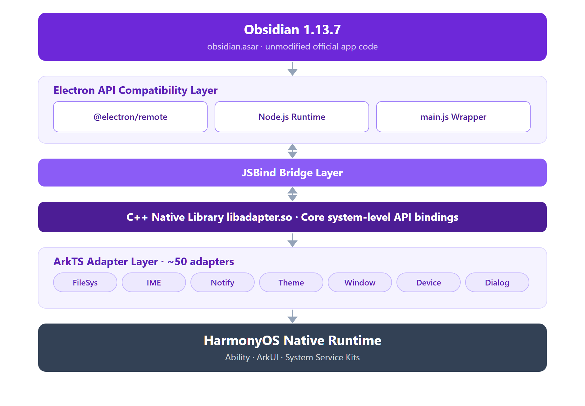

<p align="center">
  
</p>

<h1 align="center">OHsidian</h1>

<p align="center">
  <strong>Obsidian for HarmonyOS</strong>
</p>

<p align="center">
  <a href="README.md">简体中文</a> | <strong>English</strong>
</p>

<p align="center">
  Run the Obsidian note-taking experience you know on HarmonyOS tablets and 2-in-1 PCs — with multi-window support and full system-level native integration.<br>
  This fork has removed all Huawei cloud features (cloud sync, Huawei account login, AGC); see the <a href="#license">License</a> and <a href="#improvements-over-upstream">Improvements</a> sections below.<br>
  Tablets and 2-in-1 PCs only; phones are not supported.
</p>

<p align="center">
  
  
  
  
</p>

---

## Table of Contents

- [Project Introduction](#project-introduction)
- [Improvements Over Upstream](#improvements-over-upstream)
- [Tablet Feature Demo](docs/tablet-demo.md) (Chinese)
- [Technical Architecture](#technical-architecture)
- [Features](#features)
- [Module Structure](#module-structure)
- [Adapter Layer](#adapter-layer)
- [Build and Run](#build-and-run)
- [Project Structure](#project-structure)
- [Dependencies](#dependencies)
- [License](#license)
- [Acknowledgments](#acknowledgments)

---

## Project Introduction

**OHsidian** is an unofficial port of the Obsidian note-taking app for HarmonyOS. It does not reimplement Obsidian; instead, it builds a complete Electron compatibility layer that runs real Obsidian (`obsidian.asar`, the official artifact plus runtime compatibility patches) on top of the HarmonyOS native runtime.

The core idea: **simulate the Electron API surface with native HarmonyOS capabilities**. Through a C++ native library (`libadapter.so`), an ArkTS adapter layer, and JSBind bridging, Obsidian's Node.js/Electron runtime works on HarmonyOS. The project also integrates deeply with system-level capabilities (status-bar extension, IME framework, etc.) so the experience feels close to a native app.

| Item | Value |
|---------|------|
| App ID | `com.mikannqaq.obsidian` |
| Version | 1.0.0 (versionCode 1000000) |
| Target SDK | HarmonyOS 6.1.1 / API 24 |
| Target devices | Tablets, 2-in-1 PCs (phones not supported) |
| Language | ArkTS (TypeScript) |
| Build system | Hvigor |
| Core version | Obsidian 1.13.7 |

---

## Improvements Over Upstream

This fork ([PCFXPCFX/OHSidian][fork]) builds on the upstream repository ([HanversionOvO/OHSidian][upstream], created by the original OHsidian author HanversionOvO, display name MikannQAQ), with extensive fixes to windowing, input, data handling, and engineering on top of its Electron compatibility layer. For the full change log (45 rounds with per-round audits), see [docs/CHANGES-2026-09.md][changes]. For a text-and-video walkthrough of the tablet features, see the [Tablet Feature Demo][tablet-demo] (in Chinese).

### Window and Display

- Redid the window pipeline per the official immersive mode guidelines: layout fullscreen plus real system-bar insets; in touch mode the status bar and navigation bar are correctly avoided. Fixed startup not filling the screen and the dead zone along the bottom.
- The engine reads the surface size only once: added geometry-stability gating and a forced full-screen first launch, fixing the over-wide viewport and controls landing off-screen on first entry.
- Multi-window (free windows): system title bar with proper content avoidance, eliminating the double close buttons and white bar; when a window rectangle goes off-screen it is automatically clamped back to 80% of the screen and centered.
- Touch mode and multi-window mode follow the system PC-mode switch automatically.

### Input and First Launch

- Fixed vault switching and vault management in touch mode (bypassing the engine's broken native dropdown popup).
- Publishes the IME height (`--keyboard-height`) to the engine, so the formatting toolbar (bold, italic, etc.) floats correctly above the keyboard.
- Fixed the quick-start "folder not found" error (the default vault is redirected to a writable directory).

### Data Safety and Power

- In-app deletions are forced into the vault's `.trash` folder (the engine's trash bridge behaves unpredictably on HarmonyOS and may delete files permanently).
- New command-palette action "Migrate vault to a location visible in Files": copies the vault (including `.trash`) to a directory authorized via the system folder picker, so the Files app and a connected PC can access it directly (the sandbox directory itself cannot be exposed — this is a HarmonyOS constraint).
- Auto-update is disabled; HarmonyOS distribution goes through this repository's Releases. The in-engine update path (checking `obsidian-{version}.asar` update packages, RSA verification, hot-loading) is retained but never triggers, avoiding pointless network probing. To upgrade, download the new Release package and install it over the existing app.
- Removed useless cloud-sync polling, the shared single-subscription GNSS listener, screen-on foreground guards, and log truncation — less battery drain.

### Deep Links and Engineering

- `obsidian://` deep-link bridging: browser OAuth logins for plugins such as Remotely Save now work.
- Fully automated GitHub Actions builds: Releases carry SHA-256/MD5 checksums, with optional signing, dual-icon same-version releases (OHsidian icon / official Obsidian icon), optional variants, and selectable SDK combinations and build modes. `obsidian.asar` is not committed; each build downloads it from the official source, verifies the hash and signature, injects the patches and asserts all patch markers.
- Disabled ArkGuard obfuscation for release builds. Upstream release builds crash at startup due to obfuscation — this is the key fix that lets this fork ship at all.

---

## Technical Architecture



*Figure: OHsidian layered architecture. Huawei Account and Cloud Storage components are omitted (removed in this fork).*

**Layer breakdown** (top to bottom):

- **Obsidian layer**: the official obsidian-1.13.7.asar signed artifact (SHA-256 and official RSA-SHA256 verified at download time), with runtime compatibility patches injected by the `scripts/update-obsidian.mjs` pipeline (IPC guard, `obsidian://` deep-link bridge, touch-mode adaptation, default-vault redirect, auto-update disable); the note-editing core is untouched. Obsidian is proprietary software copyrighted by its owners; this repository is unaffiliated with them.
- **Electron compatibility layer**: `@electron/remote` provides the remote module API; `main.js` loads the asar and manages updates.
- **JSBind bridge layer**: connects the JS runtime to the ArkTS native layer, forwarding Electron API calls to the matching adapters.
- **C++ native library**: `libadapter.so` provides core system-level API bindings.
- **ArkTS adapter layer**: ~50 adapters wrapping HarmonyOS APIs as Electron-compatible interfaces.
- **HarmonyOS foundation**: native system capabilities such as the Ability framework and ArkUI (Huawei Account / Cloud Storage removed in this fork).

---

## Features

### Core Obsidian Experience

- Complete Obsidian 1.13.7 note editing and management.
- Full compatibility with community plugins and themes.
- Creating, managing, and browsing local vaults.
- Live Markdown preview and editing.
- Graph view, backlinks, and other advanced features.

### Multi-Window Support

- Main windows, sub-windows, embedded windows, and floating windows.
- Window position and size are persisted and restored.
- Isolated renderer processes (via `ChildProcess`).
- Status-bar extension window.

### Tablet-Specific Features

- Touch mode following the system switch, free-window clamping, keyboard avoidance, and more.
- Each feature has a text-and-video walkthrough in the [Tablet Feature Demo][tablet-demo] (in Chinese).

### Ecosystem Integration

- For attack-surface and stability reasons, this fork removed cloud sync (Cloud Foundation Kit), Huawei account one-tap login (AGC Account Kit), and AGC initialization. The related adapter files remain as dormant code and are no longer wired up.
- Status-bar extension: stays in the system status bar via `StatusBarViewExtensionAbility`.

### System-Level Native Integration

| Category | Coverage |
|------|---------|
| File system | File manager, file pickers, native dialogs, trash compatibility layer |
| Input | IME framework, drag and drop, multi-touch |
| Display | Multi-display management, dark/light theme following, custom cursors |
| Notifications | System notifications, screen-lock event listening |
| Device | Battery status, Bluetooth (classic + BLE), power management, screenshots |
| Security | Certificate management, biometric authentication, clipboard access |
| Others | Printing, text-to-speech, OCR, geolocation, external protocol handling |

---

## Module Structure

The project follows the standard two-module HarmonyOS architecture.

### `web_engine` (HAR static library)

The core engine module providing all Electron compatibility features and the adapter layer; reusable by other HarmonyOS apps.

```typescript
// Public exports (Index.ets)
export { WebAbilityStage } from './src/main/ets/application/AbilityStage'
export { WebAbility } from './src/main/ets/ability/WebAbility'
export { WebEmbeddedAbility } from './src/main/ets/ability/WebEmbeddedAbility'
export { WebWindow, WebSubWindow, WebEmbeddedWindow, WebWindowNode } from './src/main/ets/components/...'
export { WebChildProcess } from './src/main/ets/process/WebChildProcess'
```

Dependency injection uses InversifyJS to register ~50 adapters as singletons:

```text
CommonModule  → AbilityManager, DragParamManager, SystemFloatingWindowManager
AdapterModule → ContextAdapter, DragDropAdapter, MultiInputAdapter,
                NativeThemeAdapter, PermissionManagerAdapter, DialogAdapter,
                TrashAdapter, CloudSyncAdapter ...
```

### `electron` (HAP entry package)

The executable application module containing all UI pages and app logic.

**Abilities:**

| Ability | Page | Purpose |
|---------|------|------|
| `EntryAbility` | Index.ets | Main entry (Huawei cloud / AGC initialization removed in this fork) |
| `BrowserAbility` | WindowNode.ets | Browser-process window |
| `StatelessAbility` | Index.ets | Stateless window |
| `BrowserEmbeddedAbility` | EmbeddedWindow.ets | Embedded UI |
| `StatusBarEntryAbility` | StatusBarPage.ets | Status-bar extension |

**UI pages:**

| Page | Description |
|------|------|
| `Index.ets` | Main UI, hosts the `WebWindow` component |
| `WindowNode.ets` | Browser window node |
| `SubWindow.ets` | Sub-windows (dialogs, settings, etc.) |
| `EmbeddedWindow.ets` | Embedded window |
| `Login.ets` | Huawei account login page (disabled in this fork, no entry point) |
| `StatusBarPage.ets` | Status-bar page |
| `WebPage.ets` | WebView pages (privacy policy, etc.) |

---

## Adapter Layer

The adapter layer is OHsidian's most important piece of infrastructure: it wraps native HarmonyOS APIs as Electron-compatible interfaces, so Obsidian runs on HarmonyOS entirely unaware of the difference.

### Adapter Catalog

Every adapter extends `BaseAdapter`, is registered as a singleton via InversifyJS, and has a matching JSBind binding class:

```text
web_engine/src/main/ets/adapter/
├── Accessibility.ets           # Accessibility
├── AppLifecycle.ets            # App lifecycle
├── AppWindow.ets               # App window operations
├── Battery.ets                 # Battery status
├── Bluetooth.ets               # Classic Bluetooth
├── BluetoothLowEnergy.ets      # Bluetooth Low Energy
├── BrowserPolicy.ets           # Browser security policy
├── CertManager.ets             # Certificate management
├── CloudSync.ets               # Huawei cloud sync (dormant in this fork, unwired)
├── Context.ets                 # Application context
├── ContextPath.ets             # File path resolution
├── Cursor.ets                  # Custom cursors
├── Device.ets                  # Device information
├── DeviceInfo.ets              # Hardware information
├── DeviceUserAuth.ets          # Biometric authentication
├── Dialog.ets                  # Native dialogs
├── Display.ets                 # Display management
├── DragDrop.ets                # Drag and drop
├── ElectronApp.ets             # Electron App API
├── ExternalProtocol.ets        # External protocol handling
├── FileManager.ets             # File management
├── FilePicker.ets              # File pickers
├── Font.ets                    # System font enumeration
├── Geolocation.ets             # Geolocation
├── I18n.ets                    # Internationalization
├── IMF.ets                     # IME framework
├── Media.ets                   # Media playback
├── MimeType.ets                # MIME types
├── MultiInput.ets              # Multi-window input
├── NativeTheme.ets             # System theme
├── NetConnection.ets           # Network connectivity
├── Notification.ets            # System notifications
├── Ocr.ets                     # OCR
├── PasteBoard.ets              # Clipboard
├── PermissionManager.ets       # Permission management
├── PopupWindow.ets             # Popup windows
├── PowerMonitor.ets            # Power monitoring
├── Print.ets                   # Printing
├── Process.ets                 # Process management
├── RunningLock.ets             # Wake locks
├── ScreenlockMonitor.ets       # Screen-lock monitoring
├── Screenshot.ets              # Screenshots
├── ShapeDetection.ets          # Shape detection
├── Speech.ets                  # Text-to-speech
├── StatusBar.ets               # Status-bar control
├── SubWindow.ets               # Sub-window management
├── SystemFloatingWindow.ets    # System floating windows
└── Trash.ets                   # Trash operations
```

### JSBind Mechanism

Each adapter has a Bind class that registers its methods with the JS runtime:

```typescript
// Example: JSBind registration for the CloudSync adapter
JsBindingUtils.bindFunction("CloudSync.uploadFile", cloudSyncAdapter.uploadFile)
JsBindingUtils.bindFunction("CloudSync.downloadFile", cloudSyncAdapter.downloadFile)
JsBindingUtils.bindFunction("CloudSync.listCloudFiles", cloudSyncAdapter.listCloudFiles)
// ...
```

All bindings are activated at startup via `JsBindingMethod.ets`.

---

## Build and Run

### Prerequisites

| Tool | Version |
|------|---------|
| DevEco Studio | 5.0.0+ |
| HarmonyOS SDK | API 24 (6.1.1) |
| Node.js | 18.x+ |
| Hvigor | 5.0.0+ |

### Build Steps

```bash
# 1. Clone the repository
git clone https://github.com/PCFXPCFX/OHSidian.git
cd OHSidian

# 2. obsidian.asar needs no manual setup: the first build downloads it from
#    the official source and injects the patches (about 27 MB, one-time;
#    re-run "node scripts/update-obsidian.mjs" to upgrade the kernel).
#    GitHub unreachable? Drop the official obsidian-<version>.asar.gz into
#    scripts/.tmp-update/ and build — the pipeline always verifies the
#    SHA-256 and RSA signature, so the download source needs no trust.

# 3. Install dependencies (done automatically in DevEco Studio, or run manually)
hvigorw install

# 4. Build the HAP
hvigorw assembleHap

# 5. Output lands at
# build/outputs/default/electron-default-signed.hap
```

You can also open the project in DevEco Studio and click **Build > Build HAP(s)**.

### Signing Configuration

Configure signing in `build-profile.json5`:

```json5
{
  "app": {
    "signingConfigs": [
      {
        "name": "default",
        "type": "HarmonyOS",
        "material": {
          "certpath": "~/.ohos/config/your_cert.cer",
          "storePassword": "******",
          "keyAlias": "debugKey",
          "keyPassword": "******",
          "profile": "~/.ohos/config/your_profile.p7b",
          "signAlg": "SHA256withECDSA"
        }
      }
    ]
  }
}
```

---

## Project Structure

```text
OHsidian/
├── AppScope/                         # Global app configuration
│   ├── app.json5                     # bundleName, version, multi-instance mode
│   └── resources/base/
│       ├── element/string.json       # App name "OHsidian"
│       ├── media/                    # App icons (startIcon, trayIcon)
│       └── profile/                  # Font scaling configuration
│
├── web_engine/                       # HAR static library (core engine)
│   ├── Index.ets                     # Public API exports
│   ├── childProcess.ets              # Child-process exports
│   ├── oh-package.json5              # Dependencies: inversify, reflect-metadata
│   ├── hvigorfile.ts                 # harTasks build
│   └── src/main/
│       ├── ets/
│       │   ├── ability/              # WebAbility, WebEmbeddedAbility base classes
│       │   ├── adapter/              # ~50 system adapters
│       │   ├── application/          # AbilityStage
│       │   ├── common/               # DI container, constants, managers
│       │   ├── components/           # WebWindow, WebSubWindow, and other UI components
│       │   ├── interface/            # TypeScript interface definitions
│       │   ├── jsbindings/           # JSBind binding registration
│       │   ├── process/              # ChildProcess management
│       │   └── utils/                # Logging, utilities
│       ├── cpp/types/libadapter/     # C++ native library type declarations
│       └── resources/resfile/resources/app/
│           ├── main.js               # Electron bootstrap entry
│           ├── package.json          # Obsidian 1.13.7 wrapper configuration (version pins the asar fetch)
│           └── obsidian.asar         # Obsidian app package (not committed; generated automatically at build time)
│
├── electron/                         # HAP entry module
│   ├── oh-package.json5              # Dependencies: web_engine (AGC hmcore removed)
│   ├── hvigorfile.ts                 # hapTasks build
│   └── src/main/
│       ├── module.json5              # Module manifest (abilities, pages, permissions)
│       ├── ets/
│       │   ├── Application/          # MyAbilityStage
│       │   ├── entryability/         # Entry, Browser, Stateless abilities
│       │   ├── extensionAbility/     # EmbeddedAbility, StatusBar
│       │   ├── pages/                # UI pages
│       │   └── process/              # CustomChildProcess
│       ├── resources/
│       │   ├── base/element/         # String resources
│       │   ├── base/profile/         # main_pages routing
│       │   ├── rawfile/              # (AGC config removed along with cloud features)
│       │   └── zh_CN|en_US/element/  # Localized strings
│       └── ohosTest/                 # Unit tests
│
├── hvigor/                           # Hvigor build configuration
├── hvigorfile.ts                     # Root build file (appTasks)
├── build-profile.json5               # Build configuration (signing, SDK, modules)
├── oh-package.json5                  # Root package configuration
└── oh-package-lock.json5             # Dependency lock file
```

---

## Dependencies

### Runtime Dependencies

| Dependency | Version | Purpose |
|------|------|------|
| `inversify` | ^6.0.1 | IoC container managing adapter injection |
| `reflect-metadata` | ^0.1.13 | TypeScript decorator metadata |
| `@electron/remote` | ^2.1.3 | Electron remote module compatibility |
| `libadapter.so` | — | C++ native adapter library (local reference) |
| `btime` | — | File time handling |
| `get-fonts` | — | System font enumeration |

### Dev Dependencies

| Dependency | Version | Purpose |
|------|------|------|
| `@ohos/hypium` | ^1.0.6 | HarmonyOS test framework |
| `@ohos/hvigor-ohos-plugin` | — | Hvigor build plugin |

---

## License

This repository contains code and binaries from multiple sources with different licenses.

### Repository Source Code (BSD 3-Clause)

The upstream project ([HanversionOvO/OHSidian][upstream]), maintained by HanversionOvO (display name MikannQAQ), the original author of OHsidian, ships its source with per-file BSD 3-Clause headers, copyright Haitai FangYuan Co., Ltd. (~290 `.ets`/`.ts` files at present: 136 in `web_engine`, 154 in `electron`). This repository is just a fork of that project; this fork's modifications and additions are likewise released under the **BSD 3-Clause License**; see [LICENSE][license-file]. When modifying upstream files, keep the original copyright and license headers.

### Closed-Source Middle Layer (libelectron.so)

`electron/libs/arm64-v8a/libelectron.so` is the closed-source Electron/Chromium middle layer distributed by upstream, without sources. It is distributed under the same BSD 3-Clause statement; the binary embeds the BSD license text.

### Proprietary Components

- Obsidian (`obsidian.asar`): proprietary software, declared UNLICENSED in the wrapper `package.json`, and NOT covered by this repository's license. The asar in this repository is generated from the official signed artifact through the patch pipeline; modifying and redistributing it goes beyond what its terms of service authorize. Obsidian and its logos are trademarks of their respective owners; this is a non-commercial community project unaffiliated with them — reach out for takedown if needed.

### Third-Party Components

| Component | License | Evidence |
|------|------|------|
| Electron and `@electron/remote` | MIT | Bundled LICENSE file |
| InversifyJS | MIT | npm package declaration |
| `reflect-metadata` 0.2.x | Apache-2.0 | Bundled LICENSE file |
| `@ohos/hypium` | Apache-2.0 | Module `oh-package.json5` |
| HarmonyOS SDK, Hvigor, DevEco Studio | Huawei Developer Agreement | Toolchain, not distributed with this repo |

---

## Acknowledgments

This project stands on the shoulders of giants:

- [Obsidian][obsidian]: the note-taking app that changed knowledge management.
- [Electron][electron]: the cross-platform desktop application framework.
- [HarmonyOS][harmonyos]: the all-scenario distributed operating system.
- [InversifyJS][inversify]: a powerful TypeScript IoC container.

---

<p align="center">
  <sub>OHsidian is a community project and is not affiliated with the official Obsidian team.</sub>
</p>

<!-- Reference links -->

[fork]: https://github.com/PCFXPCFX/OHSidian
[upstream]: https://github.com/HanversionOvO/OHSidian
[changes]: docs/CHANGES-2026-09.md
[tablet-demo]: docs/tablet-demo.md
[license-file]: LICENSE
[obsidian]: https://obsidian.md
[electron]: https://www.electronjs.org
[harmonyos]: https://developer.huawei.com/consumer/en/harmonyos/
[inversify]: https://inversify.io
