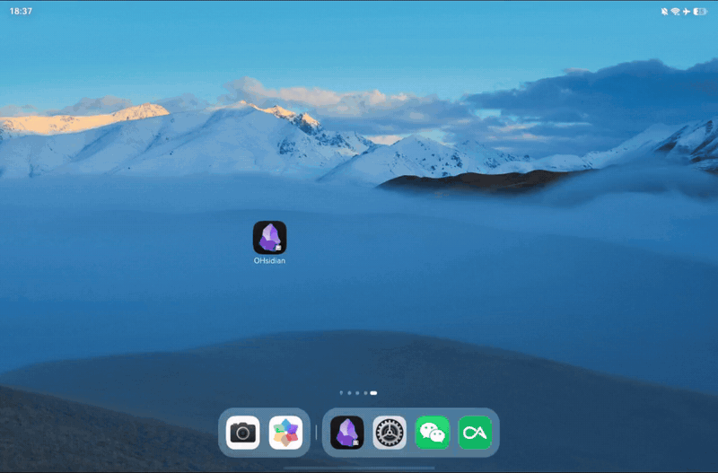

# 平板功能演示

本文档用文字与视频结合的方式，演示本 Fork（[PCFXPCFX/OHSidian][fork]）相对上游新增的平板相关功能。技术细节与完整变更记录见[变更日志][changes]。

> 所有动图与视频统一存放在 [docs/media/tablet-demo](media/tablet-demo) 文件夹。录制完成后，按各节标注的文件名放入该文件夹，文档中的图和链接会自动生效。

## 目录

- [素材说明](#素材说明)
- [触屏模式跟随系统切换](#触屏模式跟随系统切换)
- [多窗口与自由窗口](#多窗口与自由窗口)
- [输入法与格式化工具栏](#输入法与格式化工具栏)
- [触摸模式下的仓库管理](#触摸模式下的仓库管理)
- [触摸参数调节](#触摸参数调节)
- [仓库迁移到文件管理](#仓库迁移到文件管理)
- [删除进回收站](#删除进回收站)
- [深链与浏览器登录](#深链与浏览器登录)
- [状态栏扩展](#状态栏扩展)
- [外部内容拖入与分享](#外部内容拖入与分享)

---

## 素材说明

- 短演示录制 GIF 动图，嵌入正文后自动显示，建议 10 MB 以内。
- 长演示录制 MP4 视频，放入素材文件夹，正文以链接形式给出（GitHub 会在文件页面内播放），建议 50 MB 以内。
- 命名规则：`两位序号-功能英文简述.扩展名`，例如 `01-touch-mode.gif`。
- 录制建议：平板横屏、1080p 起，关闭无关通知，录前清理桌面文件列表。

每个功能对应的素材文件名如下，录好一个放一个即可。

| 序号 | 功能 | 动图 | 视频 |
|------|------|------|------|
| 01 | 触屏模式跟随系统切换 | `01-touch-mode.gif` | `01-touch-mode.mp4` |
| 02 | 多窗口与自由窗口 | `02-multi-window.gif` | `02-multi-window.mp4` |
| 03 | 输入法与格式化工具栏 | `03-ime-toolbar.gif` | `03-ime-toolbar.mp4` |
| 04 | 触摸模式下的仓库管理 | `04-vault-switch.gif` | `04-vault-switch.mp4` |
| 05 | 触摸参数调节 | `05-touch-flags.gif` | `05-touch-flags.mp4` |
| 06 | 仓库迁移到文件管理 | `06-vault-migrate.gif` | `06-vault-migrate.mp4` |
| 07 | 删除进回收站 | `07-trash.gif` | `07-trash.mp4` |
| 08 | 深链与浏览器登录 | `08-deeplink-oauth.gif` | `08-deeplink-oauth.mp4` |
| 09 | 状态栏扩展 | `09-statusbar-entry.gif` | `09-statusbar-entry.mp4` |
| 10 | 外部内容拖入与分享 | `10-drag-share.gif` | `10-drag-share.mp4` |

---

## 触屏模式跟随系统切换

**功能**：界面布局跟随设备的输入方式自动切换，无需重启应用。

| 场景 | 布局 |
|------|------|
| 平板 · 正常模式 | 触屏（移动）布局 |
| 平板 · PC 窗口模式 | 桌面布局 |
| 2in1 电脑 | 始终桌面布局 |

系统状态栏与导航条的避让区随布局实时刷新，采用官方“背景延伸 + 内容避让”的方式呈现。

**手动切换**：在命令面板执行 **“OHSidian: 切换触屏模式（自动 → 触摸 → 桌面）”**。选择会持久化保存，设回“自动”则恢复跟随系统。

**建议拍摄内容**：先在系统设置中切换 PC 模式，展示界面布局自动变化；再打开命令面板执行手动切换。

<!-- TODO：放入 01-touch-mode.gif -->


*图 1：切换 PC 模式后，界面自动变为桌面布局。*

完整视频：[01-touch-mode.mp4](media/tablet-demo/01-touch-mode.mp4)

---

## 多窗口与自由窗口

**功能**：

- 支持自由窗口多开，窗口使用系统标题条，内容正确避让，无双关闭按钮与白条。
- 窗口矩形拖出屏幕时，自动钳制到屏幕的 80% 并居中。
- 窗口位置与大小会被记住，下次打开自动恢复。

**建议拍摄内容**：新建一个自由窗口；把窗口拖向屏幕边缘，展示自动钳制；关闭后重新打开，展示位置记忆。

<!-- TODO：放入 02-multi-window.gif -->


*图 2：自由窗口拖出屏幕后被自动钳制回屏内。*

完整视频：[02-multi-window.mp4](media/tablet-demo/02-multi-window.mp4)

---

## 输入法与格式化工具栏

**功能**：触摸模式编辑笔记时，应用把输入法高度实时提供给引擎（`--keyboard-height`），加粗、斜体等格式化工具栏正确悬浮在键盘上方，不会被键盘遮挡。

**建议拍摄内容**：触摸模式打开一篇笔记，点击正文唤起键盘，展示格式化工具栏悬浮在键盘上方。

<!-- TODO：放入 03-ime-toolbar.gif -->


*图 3：格式化工具栏悬浮在键盘上方。*

完整视频：[03-ime-toolbar.mp4](media/tablet-demo/03-ime-toolbar.mp4)

---

## 触摸模式下的仓库管理

**功能**：触摸模式下，仓库切换与仓库管理界面可以正常打开（绕过引擎有缺陷的原生下拉弹窗）。首次启动的快速开始也不再报“folder not found”，因为默认仓库已重定向到可写目录。

**建议拍摄内容**：触摸模式点击左上角仓库名，打开仓库切换与管理界面。

<!-- TODO：放入 04-vault-switch.gif -->


*图 4：触摸模式正常打开仓库切换界面。*

完整视频：[04-vault-switch.mp4](media/tablet-demo/04-vault-switch.mp4)

---

## 触摸参数调节

**功能**：引擎启动时读取 `ohsidian-flags.json`（打包在应用资源中），可按设备情况调整触摸手感与界面缩放：

```json5
{
  "touchSlopDistance": 16,       // 触摸触发容差，默认 16，按钮难按可调 8~48
  "forceDeviceScaleFactor": 0,   // 界面缩放，0 表示跟随引擎默认；界面偏小可试 1.25 或 1.5
  "extraFlags": []               // 追加的原始 Chromium 开关
}
```

修改后重新打包安装，可通过 hilog 过滤 `EngineFlags` 验证参数是否生效。

**建议拍摄内容**：调整 `touchSlopDistance` 前后的按钮点击手感对比。

<!-- TODO：放入 05-touch-flags.gif -->


*图 5：调大触发容差后，按钮更容易按中。*

完整视频：[05-touch-flags.mp4](media/tablet-demo/05-touch-flags.mp4)

---

## 仓库迁移到文件管理

**功能**：在命令面板执行 **“迁移仓库到文件管理可见的位置”**，把仓库（含 `.trash`）复制到系统文件夹选择器授权的目录。之后文件管理器与电脑可以直接访问仓库文件（沙箱目录本身无法暴露，这是鸿蒙的系统约束）。

**建议拍摄内容**：执行迁移命令，完成授权，然后打开系统文件管理器查看迁移结果。

<!-- TODO：放入 06-vault-migrate.gif -->


*图 6：迁移完成后，文件管理器中可见仓库内容。*

完整视频：[06-vault-migrate.mp4](media/tablet-demo/06-vault-migrate.mp4)

---

## 删除进回收站

**功能**：在应用内删除笔记时，文件强制进入仓库的 `.trash` 文件夹，而不是被永久删除（引擎回收站桥在鸿蒙上行为不可控）。

**建议拍摄内容**：删除一篇笔记，然后展示 `.trash` 文件夹中出现该文件。

<!-- TODO：放入 07-trash.gif -->


*图 7：删除的笔记进入仓库 `.trash` 文件夹。*

完整视频：[07-trash.mp4](media/tablet-demo/07-trash.mp4)

---

## 深链与浏览器登录

**功能**：应用注册了 `obsidian://` 协议。Remotely Save、坚果云等插件的浏览器 OAuth 登录完成后，系统自动唤起 OHsidian，把回调送达插件，登录流程不再卡死在浏览器。

**建议拍摄内容**：在 Remotely Save 设置中发起浏览器登录，授权完成后展示应用自动被唤起、插件显示登录成功。

<!-- TODO：放入 08-deeplink-oauth.gif -->


*图 8：浏览器授权完成后，系统自动唤起应用完成回调。*

完整视频：[08-deeplink-oauth.mp4](media/tablet-demo/08-deeplink-oauth.mp4)

---

## 状态栏扩展

**功能**：通过 `StatusBarViewExtensionAbility` 在系统状态栏保留常驻入口。

**建议拍摄内容**：展示系统状态栏中的 OHsidian 入口及其快捷操作。

<!-- TODO：放入 09-statusbar-entry.gif -->


*图 9：系统状态栏中的 OHsidian 常驻入口。*

完整视频：[09-statusbar-entry.mp4](media/tablet-demo/09-statusbar-entry.mp4)

---

## 外部内容拖入与分享

**功能**：把外部内容直接送进正在编辑的笔记，两条通路：

- **拖入**：从中转站（单张/多张）、文件管理器、截图悬浮窗把图片或文件拖到编辑器上，松手即插入为附件。跨应用沙箱里的文件（如中转站暂存目录）由适配层借拖拽授予的 URI 权限自动复制进应用缓存，不会再出现 "Open external link?" 弹窗，也不再"拖了但插不进去"。
- **分享/碰一碰**：系统分享面板（图库、文件管理器等应用）可以把图片、视频、音频、任意文件和文本分享到 Obsidian，内容直接插入当前聚焦的笔记；应用未运行时分享，启动后自动投递。华为分享/碰一碰以 Want 形式到达的内容走同一入口。

**建议拍摄内容**：① 从中转站拖单张截图插入笔记（重点：不再弹 "Open external link?"）；② 在图库里选中一张图分享给 Obsidian，展示插入结果。

<!-- TODO：放入 10-drag-share.gif -->


*图 10：从中转站拖入单张截图与图库分享，内容直接插入笔记。*

完整视频：[10-drag-share.mp4](media/tablet-demo/10-drag-share.mp4)

---

<!-- 参考链接 -->

[fork]: https://github.com/PCFXPCFX/OHSidian
[changes]: CHANGES-2026-09.md
